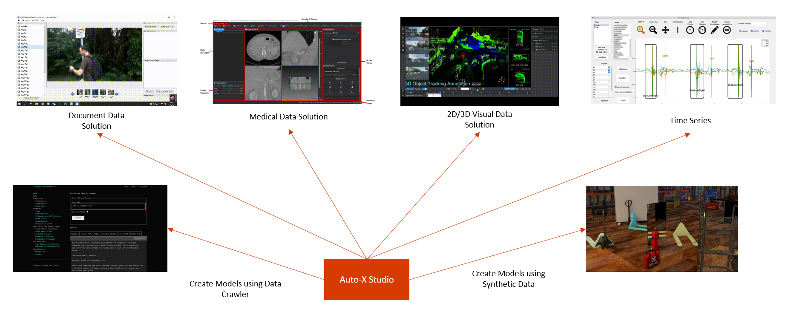

# Auto-X Studio

Auto-X Studio provides full workflows to build or finetune your own AI solution models via GUI operations with little AI knowledge.

  

## References

- [PPOCRLabel](https://github.com/PFCCLab/PPOCRLabel)
- [Xtreme1](https://github.com/xtreme1-io/xtreme1)
- [The Medical Imaging Interaction Toolkit (MITK)](https://github.com/MITK/MITK)